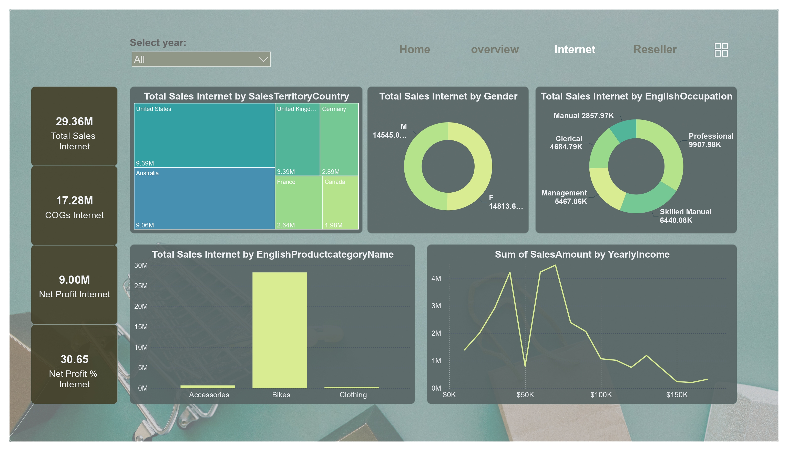

# 📊 Power BI Sales Dashboard

This project is a Power BI dashboard that analyzes a company's sales data to uncover insights and support data-driven decisions.

## 🔍 Key Features
- Sales performance overview (revenue, profit, orders)
- Regional and product-level breakdowns
- Time-series trends and KPIs
- Interactive filters by date, region, and product

## 🚀 Getting Started
1. Download or clone this repo  
2. Open the `.pbix` file in Power BI Desktop  
3. Refresh data and explore the visuals

## 🧠 Purpose
Built for business analytics practice and portfolio demonstration using real-world sales data.
